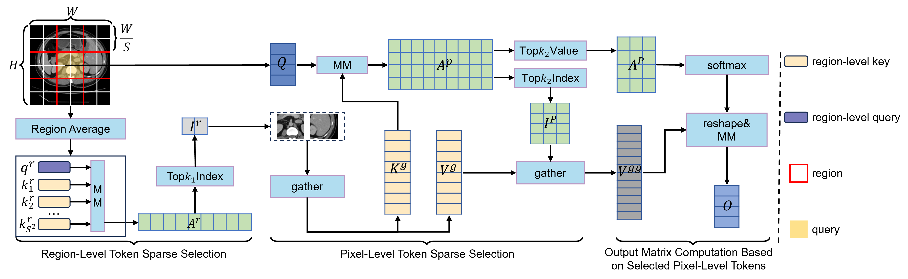
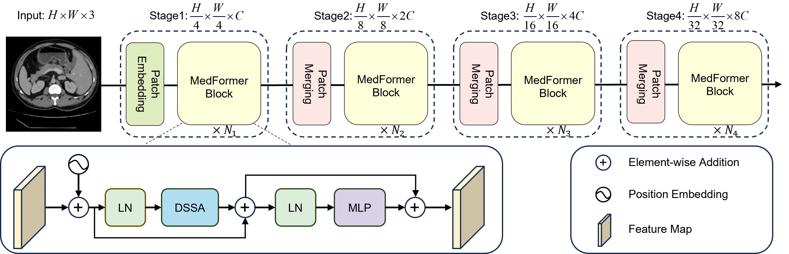

# MedFormer: Hierarchical Medical Vision Transformer with Content-Aware Dual Sparse Selection Attention
Zunhui Xia, Hongxing Li, Libin Lan

## Dual Sparse Selection Attention:
<p align="center">

</p>

## MedFormer Architecture:
<p align="center">

</p>

## Usage
### Environment
- python == 3.10
- mmcv == 2.0.0
- mmengine == 0.10.4
- numpy == 1.26.3
- torch == 2.0.0+cu118
- torchaudio == 2.0.1+cu118
### Classification
#### Data preparation
```
/path/to/data/
  train/
    class1/
      img1.jpeg
    class2/
      img2.jpeg
  val/
    class1/
      img3.jpeg
    class2/
      img4.jpeg
```
#### Training
```linux
python main.py --batch-size 90 --model medformer_base --data-path path/data --output_dir path/output --log_dir path/output
```

