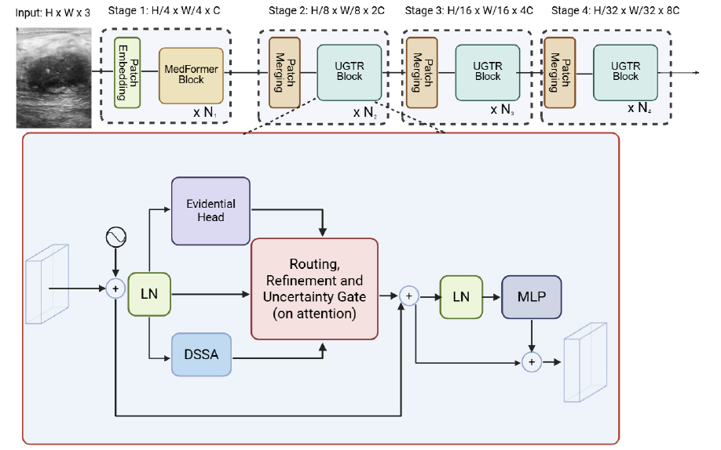
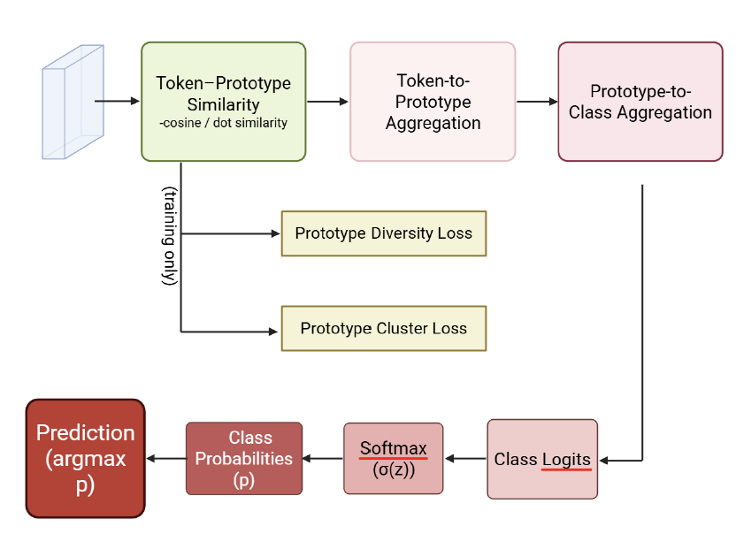

# TRU-MED: Ttrustworthy-Uncertainty-Guided Medical transformer

**TRU-MED** is an uncertainty-aware and prototype-augmented extension of **MedFormer**, a hierarchical medical vision Transformer with Content-Aware Dual Sparse Selection Attention (DSSA).  
This repository builds on the original MedFormer backbone and introduces:

- **Per-token evidential uncertainty estimation**
- **Uncertainty-guided routing and feature refinement**
- **Prototype-based representation learning for interpretable classification**

The goal of this work is to improve the **trustworthiness, interpretability, and robustness** of medical image classification without modifying the core DSSA mechanism of the original MedFormer backbone.
## Dual Sparse Selection Attention:
<p align="center">

</p>

## MedFormer Architecture:
<p align="center">

</p>
---

## Overview

Medical image classification often involves ambiguous tissue appearance, subtle lesion boundaries, inter-patient variability, and domain shift across acquisition settings. While MedFormer provides a strong hierarchical Transformer backbone for high-resolution medical imagery, it remains fundamentally deterministic and does not explicitly model uncertainty or provide prototype-based interpretability.

To address these limitations, this repository extends MedFormer with a new framework called **TRU-MED** (**T**trustworthy-**U**ncertainty-**G**uided **M**edical transformer). The method combines evidential uncertainty modeling, reliability-aware routing, local refinement, and prototype-driven decision making into a unified medical Transformer architecture.

---


### Environment
Recommended environment:

- Python 3.10
- PyTorch 2.0+
- CUDA 11.8 (if using GPU)
- NumPy 1.26+
- MMCV 2.0.0
- MMEngine 0.10.4


---

## Data Preparation

Expected classification dataset structure:

```text
/path/to/data/
  train/
    class1/
      img1.jpeg
    class2/
      img2.jpeg
  val/
    class1/
      img3.jpeg
    class2/
      img4.jpeg
```

If routing supervision is enabled, tissue or anatomical masks should be prepared in a corresponding structure expected by the dataloader implementation.

---

## Usage

### Training

```bash
python main.py --batch-size 90 --model tru_med --data-path path/data --output_dir path/output --log_dir path/output```


### Evaluation
```bash
python main.py --eval --model tru_med --resume /path/to/checkpoint.pth --data-path path/data```

---

## Example Configuration Options

Typical configuration options include:

- `USE_UNCERTAINTY_HEAD`: enable per-token evidential uncertainty estimation
- `USE_ROUTING`: enable uncertainty-guided routing
- `USE_REFINEMENT`: enable refinement branch
- `USE_ROUTING_LOSS`: enable routing supervision
- `USE_PROTO_HEAD`: enable prototype classifier
- `N_PROTO_PER_CLASS`: number of prototypes per class
- `PROTO_TEMP`: prototype similarity temperature
- `PROTO_AGG`: aggregation mode (`logsumexp`, `max`, `mean`)
- `PROTO_CLUSTER_W`: cluster loss weight
- `PROTO_DIVERSITY_W`: diversity loss weight
- `BETA_GATE`: global uncertainty gate coefficient
- `ROUTE_MAX_LAMBDA`: routing loss weight
- `ROUTE_WARMUP_EPOCHS`: routing loss warmup schedule

---


## Original Work

This repository is based on the original **MedFormer** model:

**Repository**  
[XiaZunhui/MedFormer](https://github.com/XiaZunhui/MedFormer)

**Paper**  
Xia, Zunhui and Li, Hongxing and Lan, Libin.  
**MedFormer: Hierarchical Medical Vision Transformer with Content-Aware Dual Sparse Selection Attention**.  
*arXiv preprint arXiv:2507.02488*, 2025.  
DOI: [10.48550/arXiv.2507.02488](https://doi.org/10.48550/arXiv.2507.02488)

### BibTeX for Original MedFormer
```bibtex
@article{xia2025medformer,
  author = {Xia, Zunhui and Li, Hongxing and Lan, Libin},
  title = {MedFormer: Hierarchical Medical Vision Transformer with Content-Aware Dual Sparse Selection Attention},
  journal = {arXiv preprint arXiv:2507.02488},
  year = {2025},
  month = {07},
  doi = {10.48550/arXiv.2507.02488},
  url = {https://doi.org/10.48550/arXiv.2507.02488}
}
```

---


## Acknowledgment

This work extends the original **MedFormer** framework and retains its backbone philosophy of hierarchical medical vision transformers with DSSA attention. We gratefully acknowledge the original authors for releasing their implementation and making this line of research more accessible.


## Notes

- This repository is an **extended implementation** built on top of MedFormer.
- The **core DSSA mechanism** belongs to the original MedFormer design.
- Uncertainty estimation, routing/refinement, and prototype learning are the main additions introduced in this work.

